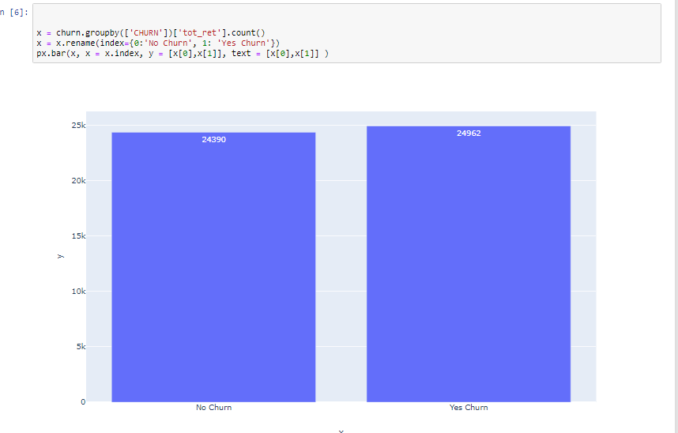
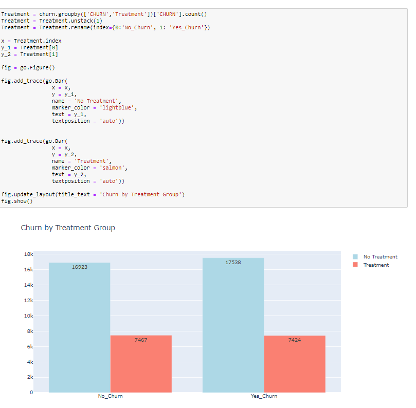
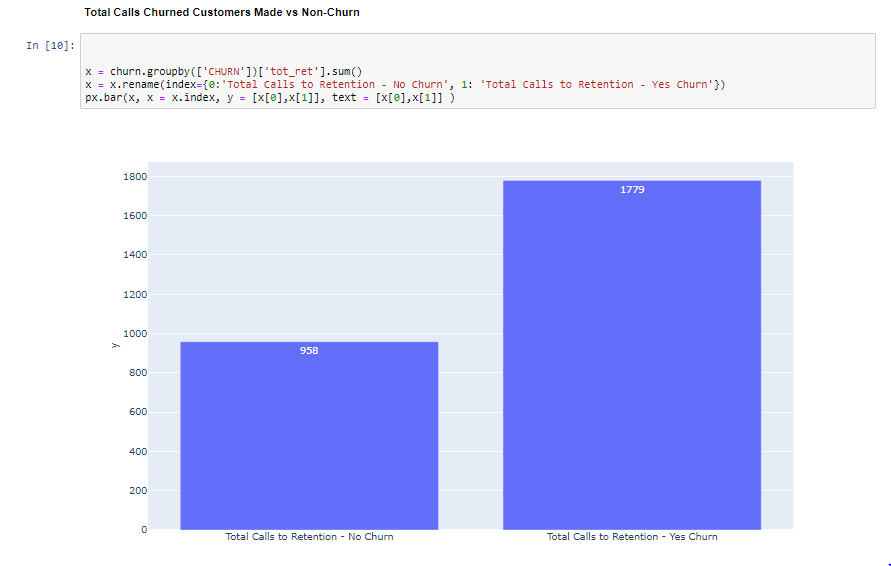
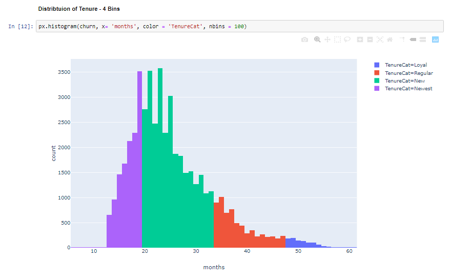
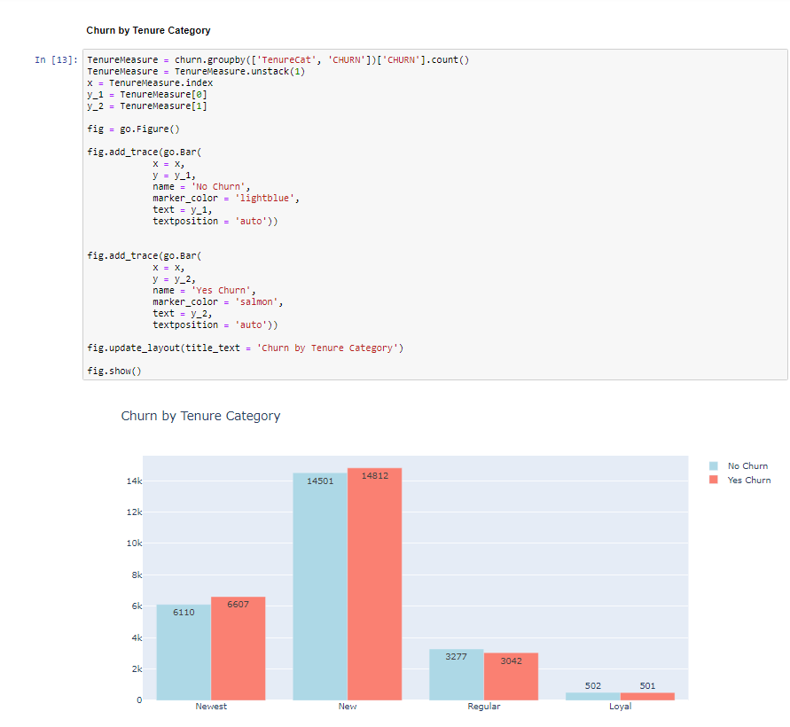
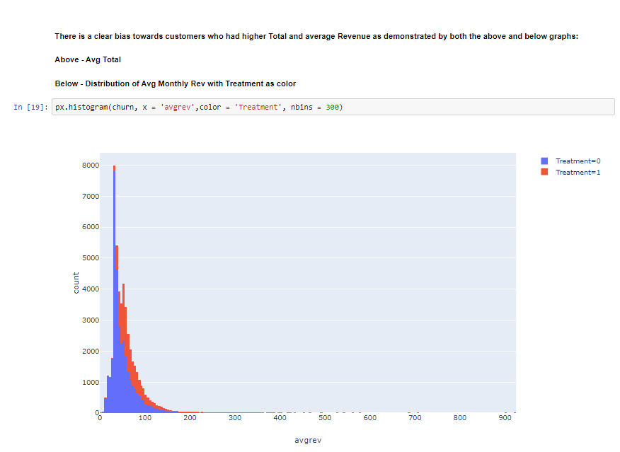
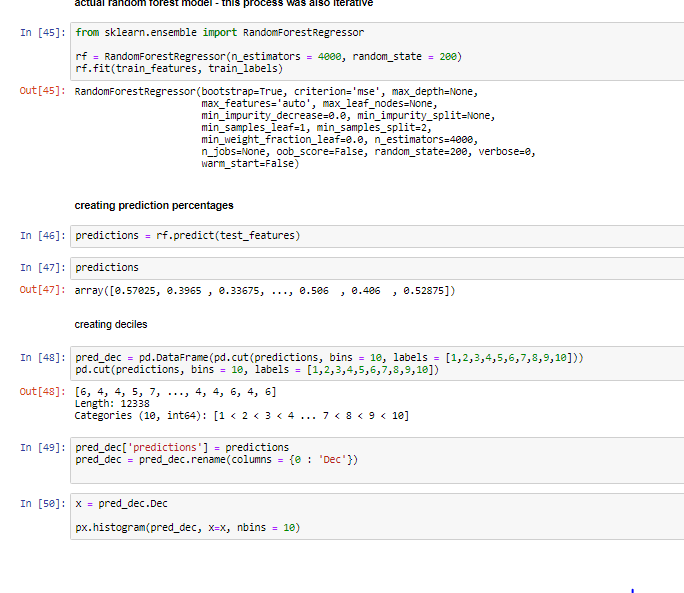
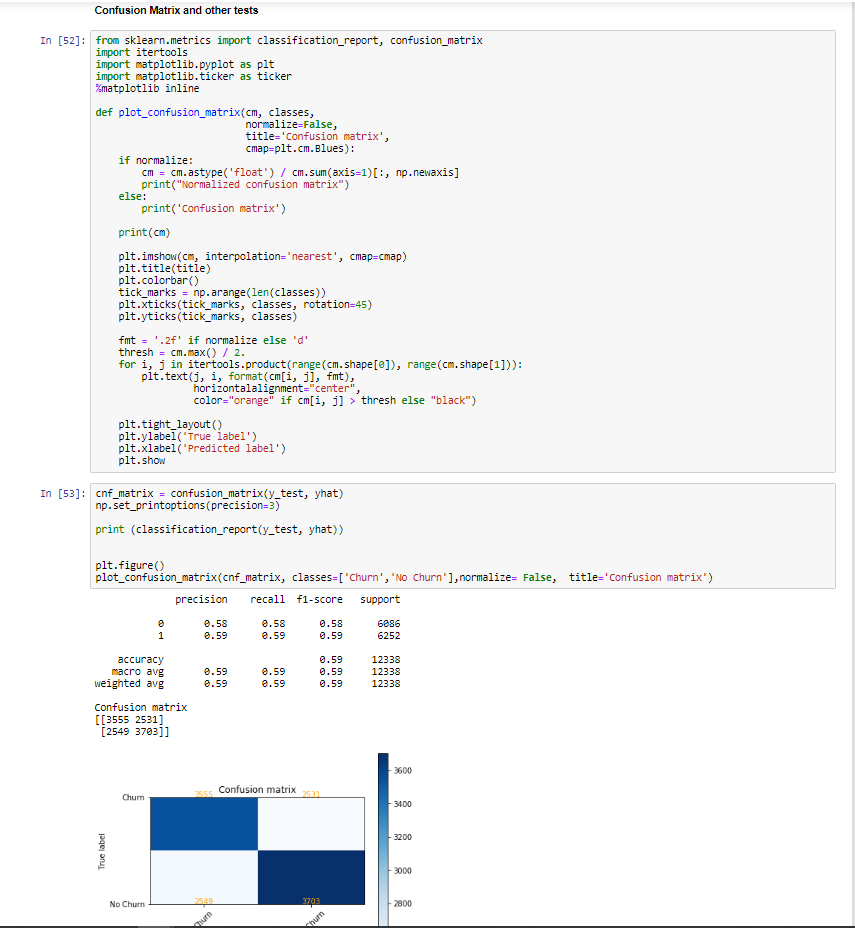

# Random_Forest_Churn
 ### Data exploration and random forest analysis on Telecom data
 * Conclusion: 9% increased precision in identifying customers who churned, after data cleaning and exploration
 * No borrowed code except for confusion matrix
 * Treatment bias discovered (image 6)

 

### Image 1

 

### Image 2

 

### Image 3

 

### Image 4

 

### Image 5

 

### Image 6

 

### Image 7

 

